# 🏥 Hospital Readmission Rate Analysis — CMS Medicare Data (FY2026)

[](.)
[](.)
[](.)
[](https://data.cms.gov/provider-data/dataset/9n3s-kdb3)
[](.)

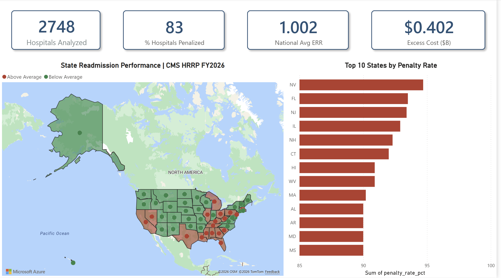

---

## 📌 Project Overview

End-to-end healthcare analytics project analyzing **30-day hospital readmission rates** across **2,245 U.S. hospitals** using CMS Hospital Readmissions Reduction Program (HRRP) FY2026 data. Hospitals face Medicare payment reductions of up to 3% for excess readmissions — this project identifies the clinical conditions, hospital types, and states driving the highest penalty exposure and translates CMS penalty data into actionable operational recommendations.

> **Note on hospital count:** The CMS HRRP dataset covers 3,055 hospitals in the published file. After excluding records where CMS suppressed data due to low case volume (`data_suppressed = 1`), **2,245 hospitals** have at least one complete, non-suppressed condition record and form the analytical universe for this project. All KPIs and findings are based on this verified, non-suppressed dataset.

**This project replicates the exact analytical workflow used by hospital quality improvement teams and healthcare payers managing HRRP compliance.**

---

## 🎯 4 Business Questions Answered

| # | Business Question | Method | Output |
|---|---|---|---|
| 1 | Which hospital types have highest 30-day readmission rates? | T-SQL aggregation + Power BI | Ownership group ERR comparison |
| 2 | What conditions drive readmissions most? | Python EDA + statistical analysis | Volume vs ERR contrast |
| 3 | Which states are above/below national average? | SQL CTEs + Power BI map | State performance bands |
| 4 | What is the cost impact of high-readmission hospitals? | Python financial modeling + Power BI | $402.0M excess cost estimate |

---

## 📊 Dashboard Preview — 6 Pages

### Page 1 — Key Findings (Executive Summary)
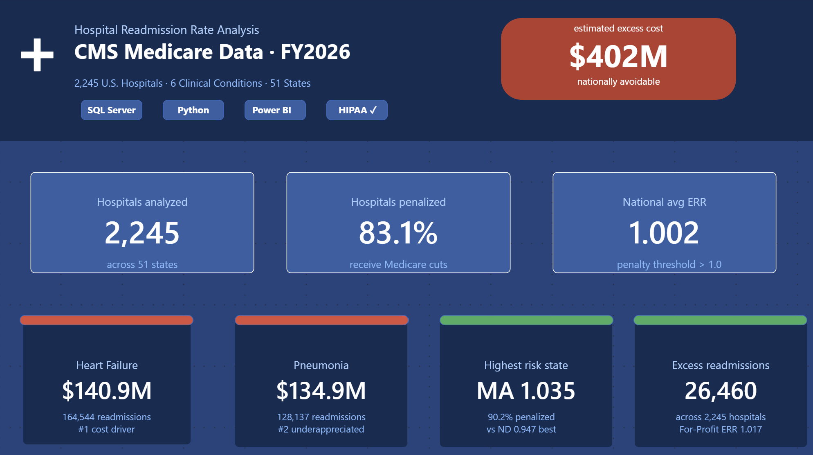

### Page 2 — Executive Overview
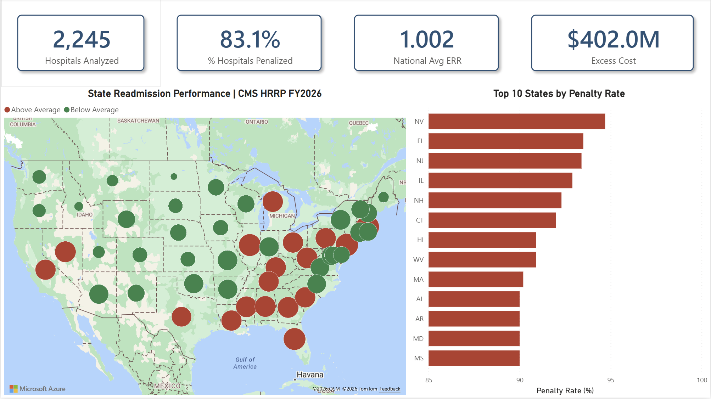

### Page 3 — Condition Analysis
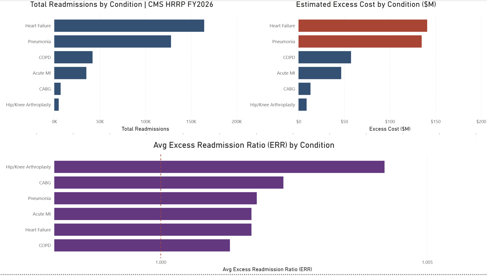

### Page 4 — Hospital Type Analysis
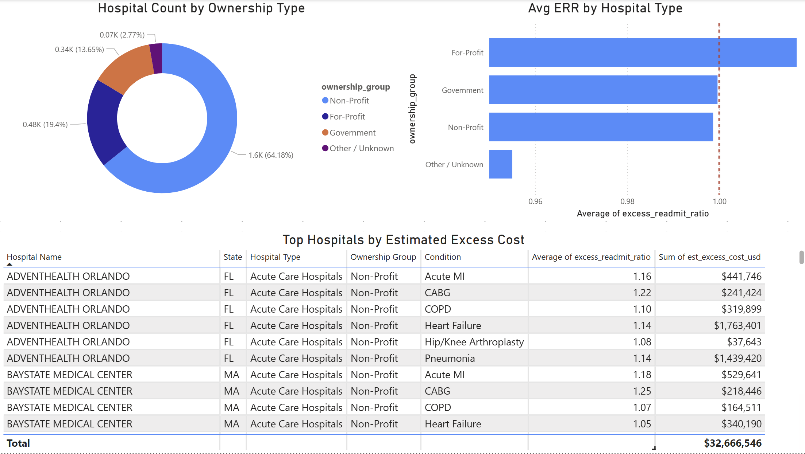

### Page 5 — Cost Impact
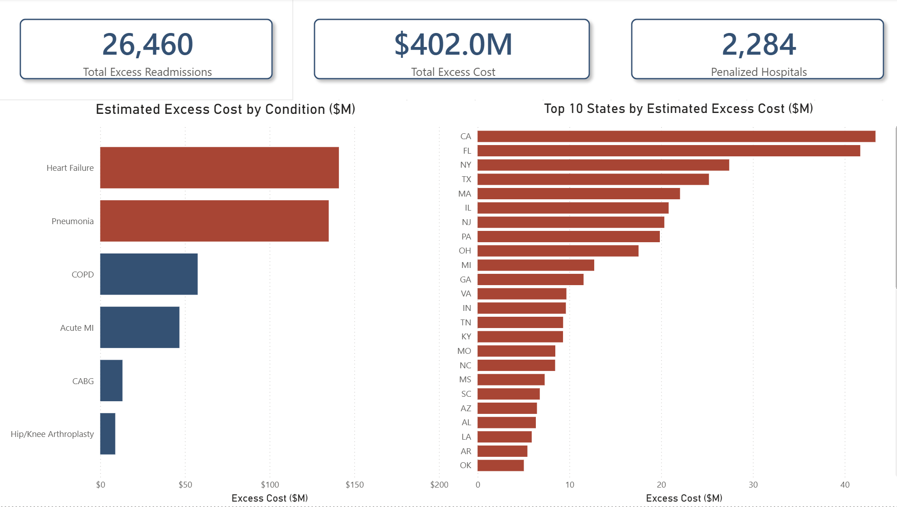

### Page 6 — State Benchmarking Tool (Interactive)
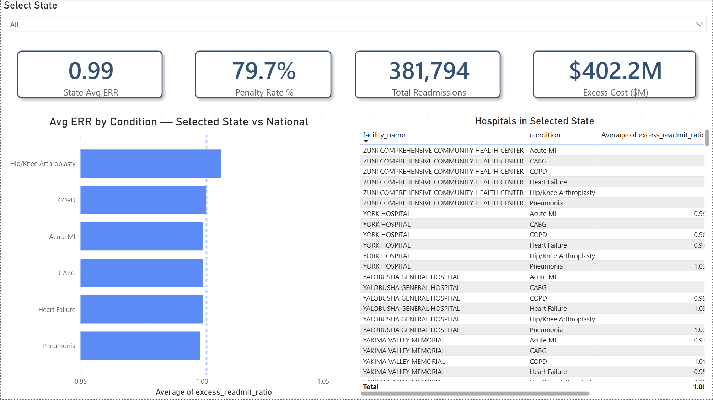
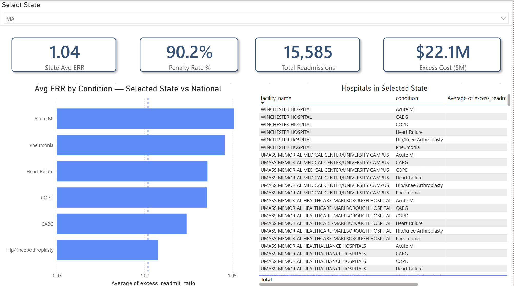
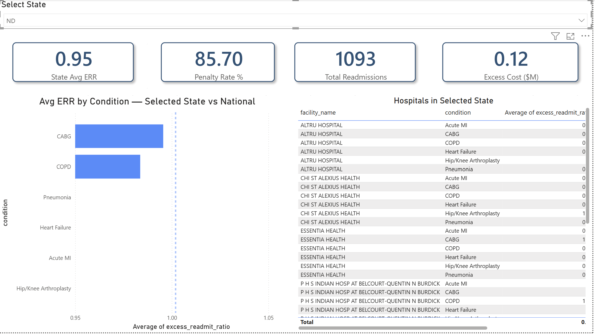

---

## 🔑 4 Key Findings

### Finding 1 — Heart Failure is the #1 national readmission burden
Heart Failure accounts for **164,544 readmissions nationally** — the highest volume of any condition tracked under HRRP. Estimated excess cost: **$140.9M**. Despite not having the highest Excess Readmission Ratio (ERR), Heart Failure's sheer patient volume makes it the primary operational and financial target for health systems nationwide.

> **Recommendation:** Health systems should implement structured post-discharge follow-up protocols (Day 3 and Day 7 phone calls, medication reconciliation, care coordinator visits) specifically for Heart Failure patients. Evidence shows these interventions reduce 30-day readmissions by 20–25%.

### Finding 2 — Pneumonia is the underappreciated #2 burden at $134.9M
Pneumonia accounts for **128,137 readmissions** and **$134.9M** in estimated excess cost — nearly equal to Heart Failure in financial impact but receives significantly less operational attention in most health systems. Heart Failure and Pneumonia together account for **69%** of all excess readmission cost nationally.

> **Recommendation:** Clinical quality teams should include Pneumonia in care transitions programs alongside Heart Failure — the combined ROI of targeting both conditions significantly exceeds targeting either alone.

### Finding 3 — Massachusetts leads nationally in readmission risk; North Dakota is the top performer
Massachusetts has the highest average ERR of **1.035**, with **90.2% of hospitals penalized** — the most concentrated penalty exposure of any state. California and Florida generate the highest total excess costs by state volume ($42M and $41M respectively). North Dakota is the national top performer with an average ERR of **0.947** — 5.5% below the national benchmark of 1.002.

> **Recommendation:** State health departments and ACOs in high-readmission states should invest in community health worker programs targeting underserved ZIP codes. Geographic clustering of high-ERR states in the Northeast and Southeast suggests systemic access and social determinant factors beyond individual hospital quality.

### Finding 4 — $402M in estimated avoidable excess readmission cost nationally
Applying the CMS average Medicare readmission cost of **$15,200 per event**, excess readmissions at penalized hospitals represent an estimated **$402.0M in avoidable expenditure** — driven by **26,460 excess readmission events** across **2,284 penalized hospitals**. For-Profit hospitals carry the highest average ERR (**1.017**) while Government hospitals perform closest to benchmark (**1.000**). AdventHealth Orlando (FL) generates the highest estimated excess cost of any single hospital in the dataset.

> **Recommendation:** Payer organizations should develop predictive risk stratification models flagging patients at discharge for high readmission risk, and tie care management resource allocation to model outputs rather than diagnosis alone.

---

## 🛠️ Tech Stack

| Tool | Purpose |
|---|---|
| **SQL Server (T-SQL)** | Data staging, cleaning, transformation, 4 analytical views for Power BI |
| **Python** (Pandas, NumPy, Matplotlib, Seaborn, SciPy) | EDA, statistical analysis, publication-quality visualizations |
| **Power BI** (DAX) | 6-page interactive dashboard with cross-filtering, drillthrough, and state slicer |
| **CMS HRRP FY2026** | Primary dataset — data.cms.gov |
| **CMS Hospital General Information** | Dimension data — hospital type, ownership, location |

---

## 📈 Key Metrics at a Glance

| Metric | Value |
|---|---|
| Hospitals Analyzed (non-suppressed) | **2,245** |
| States Covered | 51 |
| Clinical Conditions Tracked | 6 |
| Total Readmissions (National) | 381,794 |
| National Average ERR | 1.002 |
| % Hospitals Penalized | 83.1% |
| Total Excess Readmissions | 26,460 |
| Estimated Excess Cost | **$402.0M** |
| Penalized Hospitals | 2,284 |
| Highest-Risk State (ERR) | Massachusetts (ERR 1.035, 90.2% penalized) |
| Top Performer State | North Dakota (ERR 0.947) |
| Highest-Cost State (volume) | California ($42M), Florida ($41M) |
| Highest-Cost Hospital | AdventHealth Orlando, FL |
| Highest-Burden Condition | Heart Failure (164,544 readmissions, $140.9M) |
| #2 Burden Condition | Pneumonia (128,137 readmissions, $134.9M) |
| For-Profit Avg ERR | 1.017 (highest ownership group) |
| Government Avg ERR | 1.000 (best performing ownership group) |

---

## 📁 Repository Structure

```
hospital-readmission-cms-analysis/
│
├── README.md
│
├── sql/
│   ├── 01_create_tables.sql            # Database creation, staging tables, BULK INSERT
│   ├── 02_data_cleaning.sql            # Type casting, condition mapping, derived columns
│   ├── 03a_analysis_queries.sql        # 4 business question queries
│   ├── 03b_fix_null_columns.sql        # Data quality fix — float-to-int casting
│   ├── 03c_fix_rate_scale.sql          # Rate scale correction (÷100 fix)
│   └── 04_views_for_powerbi.sql        # 4 Power BI views (vw_hospital_detail, etc.)
│
├── python/
│   ├── 01_eda_and_cleaning.ipynb       # Data loading, column mapping, derived flags
│   ├── 02_statistical_analysis.ipynb   # 4 business questions, t-tests, key findings
│   └── 03_visualizations.ipynb         # 6 publication-quality charts
│
├── powerbi/
│   └── HealthCare_Analytics_Dashboard.pbix
│
├── data/
│   ├── raw/                            # Original CMS files (not committed — see .gitignore)
│   └── processed/                      # Cleaned CSVs generated by Python notebooks
│       ├── readmission_clean.csv
│       ├── condition_summary.csv
│       ├── state_summary.csv
│       ├── hospital_type_summary.csv
│       └── cost_by_condition.csv
│
├── assets/
│   ├── dashboard_hero.png
│   ├── dashboard_page6_key_findings.png
│   ├── dashboard_page1_executive_overview.png
│   ├── dashboard_page2_condition_analysis.png
│   ├── dashboard_page3_hospital_type.png
│   ├── dashboard_page4_cost_impact.png
│   ├── dashboard_page5_state_benchmarking.png
│   ├── dashboard_page5_state_benchmarking_MA.png
│   ├── dashboard_page5_state_benchmarking_ND.png
│   ├── chart1_err_by_condition.png
│   ├── chart2_state_performance.png
│   ├── chart3_condition_bubble.png
│   ├── chart4_excess_cost_by_condition.png
│   ├── chart5_penalty_by_ownership.png
│   └── chart6_top_bottom_states.png
│
└── .gitignore
```

---

## 🚀 How to Reproduce

### Prerequisites
- SQL Server (any edition including Express)
- Python 3.11+ with: `pandas numpy matplotlib seaborn scipy`
- Power BI Desktop (free)

### Step 1 — Download CMS Data
- HRRP FY2026: [data.cms.gov/provider-data/dataset/9n3s-kdb3](https://data.cms.gov/provider-data/dataset/9n3s-kdb3)
- Hospital General Information: [data.cms.gov/provider-data/dataset/xubh-q36u](https://data.cms.gov/provider-data/dataset/xubh-q36u)

### Step 2 — SQL Pipeline
```sql
-- Run in order in SSMS:
sql/01_create_tables.sql         -- creates DB, staging tables, loads raw CMS data
sql/02_data_cleaning.sql         -- builds dim_hospital + fact_readmissions
sql/03a_analysis_queries.sql     -- 4 business question queries (validation)
sql/03b_fix_null_columns.sql     -- fixes float-to-int casting (pandas export issue)
sql/03c_fix_rate_scale.sql       -- corrects expected_readmit_rate scale (÷100)
sql/04_views_for_powerbi.sql     -- creates 4 views: vw_hospital_detail,
                                 --   vw_condition_summary, vw_state_summary,
                                 --   vw_executive_kpis
```

### Step 3 — Python Notebooks
```bash
pip install pandas numpy matplotlib seaborn scipy
# Run notebooks in order from the python/ directory:
# 01 → 02 → 03
```

### Step 4 — Power BI Dashboard
1. Open `powerbi/HealthCare_Analytics_Dashboard.pbix`
2. Home → Transform data → Data source settings
3. Update server name to your SQL Server instance
4. Click **Refresh**

> **Data note:** The dashboard filters all visuals to `data_suppressed = 0` via DAX measures and SQL views, ensuring all KPIs reflect only complete, non-suppressed CMS records.

---

## 📊 Python Visualizations

### ERR Distribution by Condition
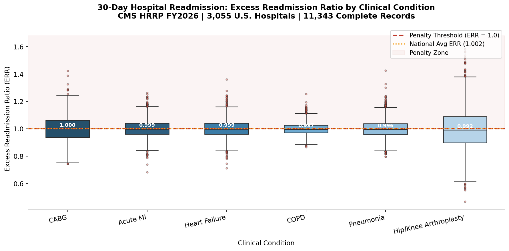

### State Performance vs National Average
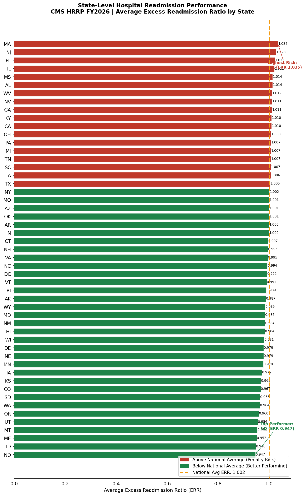

### Readmission Rate vs ERR Bubble Chart
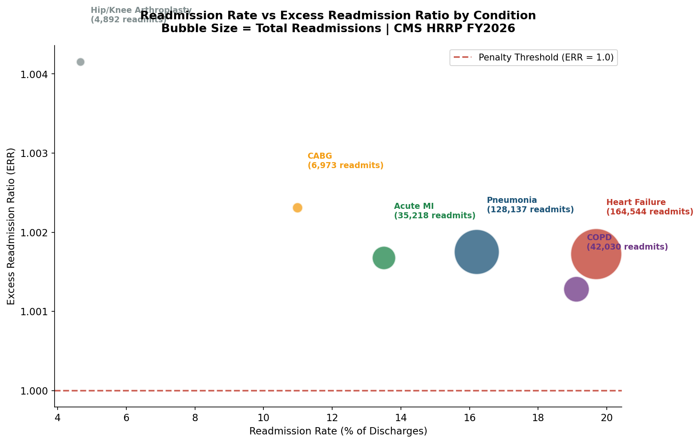

### Excess Cost by Condition
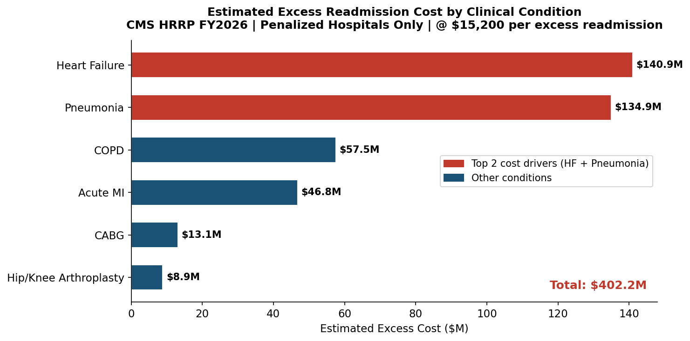

### Penalty Rate by Hospital Ownership
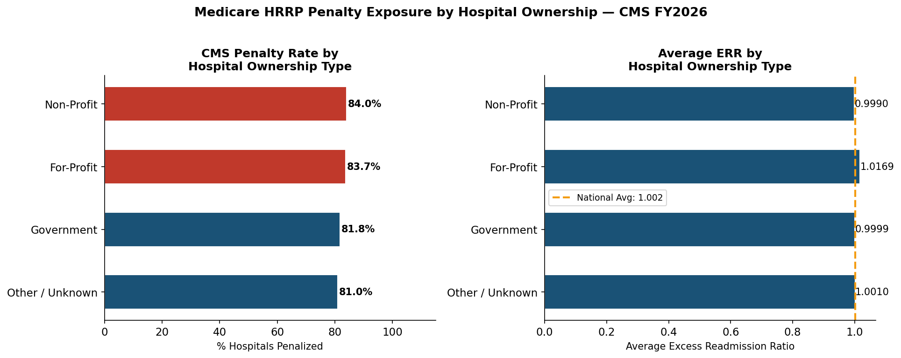

### Top 10 vs Bottom 10 States
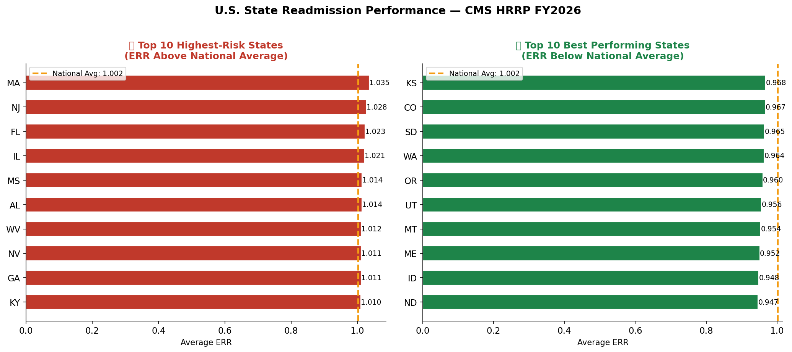

---

## 🏥 Clinical Context

**What is the Excess Readmission Ratio (ERR)?**
ERR is the core CMS metric. An ERR > 1.0 means a hospital has more readmissions than expected given its patient population. CMS calculates the expected rate using risk-adjustment models accounting for patient demographics and comorbidities. Hospitals with ERR > 1.0 on any of the 6 tracked conditions receive a Medicare payment reduction of up to 3%.

**6 Conditions Tracked by CMS HRRP:**
- Acute Myocardial Infarction (AMI)
- Coronary Artery Bypass Graft (CABG)
- Chronic Obstructive Pulmonary Disease (COPD)
- Heart Failure (HF)
- Hip/Knee Arthroplasty
- Pneumonia (PN)

**Data Suppression:** CMS suppresses data for hospitals with fewer than 25 cases in a condition to protect patient privacy. These records are flagged as `data_suppressed = 1` and excluded from all KPI calculations. Of 14,940 total records loaded, 5,636 rows are suppressed — leaving 9,304 complete records across 2,245 distinct hospitals forming the analytical universe.

---

## 🔗 Connect

**Loknadh Venkata Krishna Sai Kona**
MS Data Science — University of Memphis (GPA 3.81)

[](https://linkedin.com/in/lvkrishna3)
[](https://github.com/KrishnaSai315)

---

*Data Source: CMS Hospital Readmissions Reduction Program FY2026 — publicly available at data.cms.gov*
*Cost estimates use $15,200 per readmission (CMS Medicare average FY2024). Estimates are illustrative and not official CMS financial figures.*
